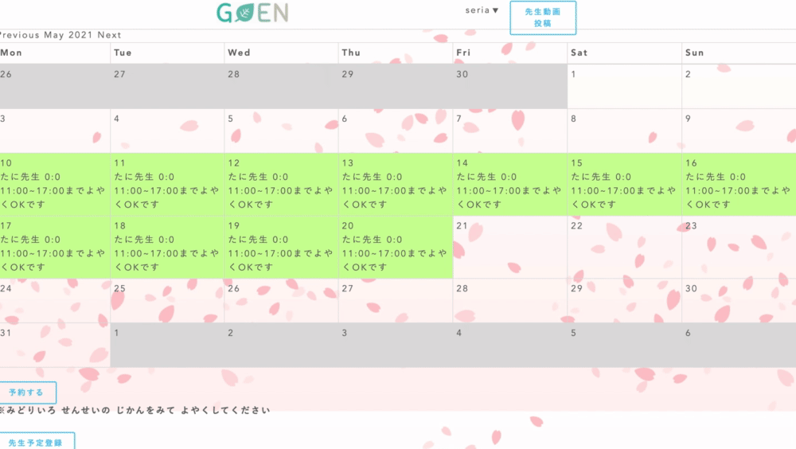

# Goen

日本語教師と日本語学習者のためのマッチングアプリです

## 概要
日本語教師が2~3分の体験授業紹介動画を投稿します。 
それを見た学習者が予約ページで体験授業を予約することができます。 
学習者に実際に体験授業を1回無料で受けてもらって、マッチングします。  

## 本番環境
https://goen-32399.herokuapp.com/ 
※ゲストログイン機能を実装したのでお気軽にご覧ください
※Herokuの仕様で動画がリンク切れになっている可能性があります。
## テストアカウント 
#### 先生　
Email:yamazaki@yamazaki 
パスワード：mako00 
#### 学習者　
Email:mako@mako 
パスワード:mako00 

## 制作背景
日本語教師と学習者をマッチングするwebサイト・アプリは存在しますが、特定の教師に人気が集中してしまい、資格や経験がないと難しい状況なので、未経験でもチャレンジできる環境を作りたくて、このアプリを制作しました。
本アプリは教師歴や資格などを記載せずフラットな状態で、純粋に現在の体験授業の実力で勝負できる環境を提供しています。

## 詳細説明

### 機能一覧
動画一覧機能 
動画投稿機能 
動画削除機能 
動画編集機能 
体験授業予約機能 
予約削除機能 
ユーザー登録/ログイン機能 
検索機能 
メッセージ機能  

### トップページ

トップ画面の動画です。お茶の「Goenとは？」ボタンを押すとこのアプリの説明が表示され、お寿司の「先生へ」ボタンを押すと先生がこのアプリを使うメリット・使い方が表示され、三色団子の「にほんごをべんきょうしたいみなさんへ」ボタンを押すと学習者がこのアプリを使うメリット・使い方が表示されます。

### 動画一覧ページ

動画一覧ページでは先生が投稿した動画が新しい順に上から表示されます。動画は音声抜きで自動再生されます。動画の右上にマウスを持っていくと「せんせいにメッセージをおくる」ボタンが表示されます。ページ上の「検索」ボタンで学習者が動画を検索することができます。動画右下の「体験授業を予約する」ボタンを押すとカレンダーページへ遷移し、体験授業を予約することができます。

### 先生動画投稿ページ

ヘッダーの「先生動画投稿」ボタンを押すと、「あなたはほんとうにせんせいですか？」というアラートが出て「OK」を押すと動画投稿ページへ遷移します。動画ファイルを選択し、レベル・内容を選んで「SEND」を押すと動画が投稿されます。

### カレンダーページ

カレンダーの緑色の部分が先生が都合がいい時間で、それを見て学習者が予約します。都合が悪くなった場合は予約した学習者本人であれば、予約を削除することもできます。下の「予約する」ボタンを押すと予約フォームに遷移します。「先生予約登録」ボタンを押すと先生がスケジュールを登録することができ、カレンダーに緑色で表示されます。

### メッセージページ

動画の右上の「せんせいにメッセージをおくる」ボタンを押すと、メッセージページへ遷移します。このページでは先生と学習者が直接メッセージのやりとりをすることができます。

## 工夫したポイント
先生が2~3分の体験授業紹介の動画を投稿することにより、学習者に興味を持ってもらえるように工夫しました。 
トップページに「Goenとは？」「先生へ」「学習者へ」という説明ページを作り、このアプリの目的・使い方がユーザーに伝わるようにしました。 
学習者が体験授業を予約する際に、先生の予定が緑色で表示されるようにしました。 
日本語初級者でもわかるように、部分的にひらがな表記にしました。 
学習者が先生にメッセージを送れるようにメッセージ機能をつけました。 
学習者が動画を探しやすくするために検索機能をつけました。 
見た目がオシャレで動きがあるアプリにしたかったので、jQueryを使ってトップページを作りました。 
動画一覧ページの動画も自動再生するようにして、先生の表情が一覧ページでも見えるように工夫しました。 

## 使用技術(開発環境)
ruby 2.6.5 
Rails 6.0.3.6
HTML/CSS 
Javascript/jQuery

## 課題や今後実装したい機能

### ユーザーの使い分け
現状、先生と学習者で同じ機能になってしまっているので、ユーザー管理機能を先生と学習者で分けて、使える機能を分けて実装したいです。具体的には動画とスケジュールの投稿は先生のみ、体験授業予約と削除は学習者のみ、メッセージは先生と学習者の両方ができるようにしたいです。
現在は「先生動画投稿」「先生専用ページ」に学習者が間違えてアクセスしないように、この2つのボタンを押すと「あなたは本当に先生ですか？」というアラートが出るようになっています。

### 通知機能
現状、先生がカレンダーを確認すると、学習者からの体験授業の予約が入ったことがわかる状態ですが、通知機能をつけて、学習者が予約したら、先生に通知メールが来るように実装したいです。

### テストコード
テストコードの記載がまだなので、単体テストを実装する予定です。

## DB設計

### users テーブル

| Column             | Type   | Options     |
| ------------------ | ------ | ----------- |
| nickname           | string | null: false |
| email              | string | null: false |
| encrypted_password | string | null: false |

#### Association

- has_many :tweets
- has_many :comments
- has_many :reservations

### tweets テーブル

| Column  | Type     | Options      |
| ------- | -------- | ------------ |
| text    | string   | null: false  |
| video   | string   | null: false  |
| user_id | integer  | null: false  |
| level   | string   | null: false  |

#### Association

- belongs_to :user
- has_many :comments
- has_many :reservations

###  reservationsテーブル

| Column     | Type       | Options   |
| ---------- | ---------- | --------- |
| content    | text       |           |
| start_time | datetime   |           |
| end_time   | datetime   |           |
| level      | string     |           |
| user_id    | integer    |           |
| tweet_id   | integer    |           |
| schedule   | text       |           |

#### Association

- belongs_to :user
- belongs_to :tweet

### comments テーブル

| Column   | Type       | Options |
| -------- | ---------- | ------- |
| text     | text       |         |
| user_id  | integer    |         |
| tweet_id | integer    |         |

#### Association

- belongs_to :tweet
- belongs_to :user

